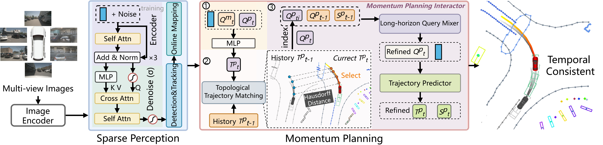

# Don't Shake the Wheel: Momentum-Aware Planning in End-to-End Autonomous Driving


<div align="center">
  
</div>

## Abstract
<div align="justify">  
End-to-end autonomous driving frameworks facilitate seamless integration of perception and planning but often rely on one-shot trajectory prediction, lacking temporal consistency and long-horizon awareness. This limitation can lead to unstable control, undesirable shifts, and vulnerability to occlusions in single-frame perception. In this work, we propose the Momentum-Aware Driving (MomAD) framework to address these issues by introducing trajectory momentum and perception momentum to stabilize and refine trajectory prediction. MomAD consists of two key components: (1) Topological Trajectory Matching (TTM), which uses Hausdorff Distance to align predictions with prior paths and ensure temporal coherence, and (2) Momentum Planning Interactor (MPI), which cross-attends the planning query with historical spatial-temporal context. Additionally, an encoder-decoder module introduces feature perturbations to increase robustness against perception noise. To quantify planning stability, we propose the Trajectory Prediction Consistency (TPC) metric, showing that MomAD achieves long-term consistency (>3s) on the nuScenes dataset. We further curate the challenging Turning-nuScenes validation set, focused on turning scenarios, where MomAD surpasses state-of-the-art methods, highlighting its enhanced stability and responsiveness in dynamic driving conditions.
</div>
<div align="justify">


:fire: Contributions:
* **Momentum Planning Concept.** We propose the concept of momentum planning in multi-modal trajectory planning, drawing an analogy to human driving behavior. We provide theoretical evidence to demonstrate the effectiveness of our momentum planning in addressing temporal consistency in end-to-end autonomous driving

* **MomAD Framework.** We propose MomAD, an end-to-end autonomous driving framework that employs momentum planning. It optimizes current trajectory planning by integrating historical planning guidance, significantly improving trajectory consistency and stability in autonomous driving.

* **Turning NuScenes Validation Dataset.** We create the Turning-nuScenes val dataset, derived from the nuScenes full validation dataset. This new dataset focuses on turning scenarios, providing a specialized benchmark for evaluating the performance of autonomous driving systems in complex driving situations.

* **Trajectory Prediction Consistency (TPC) Metric.** We introduce the TPC metric to quantitatively assess the consistency of trajectory predictions in existing end-to-end autonomous driving methods, addressing a critical gap in the evaluation of trajectory planning.

* **Performance Evaluation.** Through extensive experiments on the nuScenes dataset, we demonstrate that MomAD significantly outperforms SOTA methods in terms of trajectory consistency and stability, highlighting its effectiveness in tackling challenges within autonomous driving planning. We evaluated the results of long trajectory predictions, specifically at 4, 5, and 6 seconds, which are critical for ensuring the stability of autonomous driving systems.
</div>


## Method
<center>
    
    <br>
    <div style="color:orange; border-bottom: 1px solid #d9d9d9;
    display: inline-block;
    color: #999;
    padding: 2px;">The overall architecture of MomAD. MomAD, as a multi-model trajectory end-to-end autonomous driving method, first encodes multi-view images into feature maps, then learns a sparse scene representation through sparse perception, and finally performs a momentum-guided motion planner to accomplish the planning task. The momentum planning module integrates historical planning to inform current planning, effectively addressing the issue of maximum score deviation in multi-modal trajectories.</div>
</center>


## Results in paper

### Open-loop mertics

- Planning results on [nuScenes](https://github.com/nutonomy/nuscenes-devkit).

| Method | Backbone | L2 (m) 1s  | L2 (m) 2s | L2 (m) 3s | L2 (m) Avg | Col. (%) 1s | Col. (%) 2s | Col. (%) 3s | Col. (%) Avg | TPC (m) 1s | TPC (m) 2s | TPC (m) 3s | TPC (m) Avg | FPS |
| :---: | :---:| :---: | :---: | :---: | :---: | :---: | :---: | :---: | :---: | :---: | :---: | :---: | :---: |:---: |
| UniAD | ResNet101 | 0.45 | 0.70 | 1.04 |0.73 | 0.62 | 0.58 | 0.63 | 0.61 |0.41 | 0.68 | 0.97 | 0.68 |1.8 (A100)|
SparseDrive |ResNet50| **0.29**  | 0.58  | 0.96 |  0.61 |  **0.01** |  **0.05** |  0.18 |  **0.08** |  **0.30** |  0.57 |  0.85 |  0.57 |  **9.0 (4090)**|
**MomAD (Ours)** |  ResNet50    |  0.31 |  **0.57** |  **0.91**  | **0.60** |  **0.01** |  **0.05**  | **0.22**  | 0.09  | **0.30** |  **0.53** |  **0.78** |  **0.54** |  7.8 (4090) | 

- Planning results for long trajectory prediction on [nuScenes](https://github.com/nutonomy/nuscenes-devkit).  We train 10 epochs on 6s trajectories and test on 6s trajectories.

| Method | L2 (m) 4s  | L2 (m) 5s | L2 (m) 6s | Col. (%) 4s | Col. (%) 5s | Col. (%) 6s | TPC (m) 4s | TPC (m) 5s | TPC (m) 6s |
| :---: | :---:| :---: | :---: | :---: | :---: | :---: | :---: | :---: | :---: |
SparseDrive   | 1.75|2.32|2.95| 0.87| 1.54| 2.33| 1.33| 1.66| 1.99|
**MomAD (Ours)** |  **1.67**| **1.98**| **2.45**| **0.83**| **1.43**| **2.13**| **1.19**| **1.45**| **1.61**|

- Planning results on the Turning-nuScenes validation dataset [Turning-nuScenes ](nuscenes_infos_val_hrad_planing_scene.pkl).  We train 10 epochs on 6s trajectories and test on 6s trajectories.

| Method |L2 (m) 1s  | L2 (m) 2s | L2 (m) 3s  | Col. (%) 1s | Col. (%) 2s | Col. (%) 3s | TPC (m) 1s | TPC (m) 2s | TPC (m) 3s |
| :---: | :---:| :---: | :---: | :---: | :---: | :---: | :---: | :---: | :---: |
SparseDrive   |0.35 | 0.77 | 1.46 | 0.86 | 0.04 | 0.17 | 0.98 | 0.40 | 0.34 | 0.70 | 1.33 | 0.79|
**MomAD (Ours)** | 0.33| 0.70| 1.24| 0.76| 0.03| 0.13| 0.79| 0.32| 0.32| 0.54| 1.05| 0.63|


### Close-loop mertics

- Open-loop and Closed-loop Results of E2E-AD Methods in Bench2Drive (V0.0.3)} under base training set. `mmt' denotes the extension of VAD on Multi-modal Trajectory. * denotes our re-implementation. The metircs momad used follows [Bench2Drive](https://github.com/Thinklab-SJTU/Bench2Drive)

<table border="1">
  <thead>
    <tr>
      <th rowspan="2">Method</th>
      <th colspan="1">Open-loop Metric</th>
      <th colspan="4">Closed-loop Metric</th>
    </tr>
    <tr>
      <th>Avg. L2 ↓</th>
      <th>DS ↑</th>
      <th>SR(%) ↑</th>
      <th>Effi ↑</th>
      <th>Comf ↑</th>
    </tr>
  </thead>
  <tbody>
    <tr>
      <td>VAD</td>
      <td>0.91</td>
      <td>42.35</td>
      <td>15.00</td>
      <td>157.94</td>
      <td>46.01</td>
    </tr>
    <tr>
      <td>VAD mmt*</td>
      <td>0.89</td>
      <td>42.87</td>
      <td>15.91</td>
      <td>158.12</td>
      <td>47.22</td>
    </tr>
    <tr>
      <td>Our MomAD (Euclidean)</td>
      <td>0.84</td>
      <td>46.12</td>
      <td>17.45</td>
      <td>173.35</td>
      <td>50.98</td>
    </tr>
    <tr>
      <td>Our MomAD</td>
      <td>0.85</td>
      <td>45.35</td>
      <td>17.44</td>
      <td>162.09</td>
      <td>49.34</td>
    </tr>
    <tr>
      <td>SparcDrive*</td>
      <td>0.87</td>
      <td>44.54</td>
      <td>16.71</td>
      <td>170.21</td>
      <td>48.63</td>
    </tr>
    <tr>
      <td>Our MomAD (Euclidean)</td>
      <td>0.84</td>
      <td>46.12</td>
      <td>17.45</td>
      <td>173.35</td>
      <td>50.98</td>
    </tr>
    <tr>
      <td>Our MomAD</td>
      <td>0.82</td>
      <td>47.91</td>
      <td>18.11</td>
      <td>174.91</td>
      <td>51.20</td>
    </tr>
  </tbody>
</table>

### Robustness evaluation

- Robustness analysis on [nuScenes-C](https://github.com/thu-ml/3D_Corruptions_AD)

<table border="1">
  <thead>
    <tr>
      <th rowspan="2">Setting</th>
      <th rowspan="2">Method</th>
      <th colspan="2">Detection</th>
      <th colspan="1">Tracking</th>
      <th colspan="1">Mapping</th>
      <th colspan="1">Motion</th>
      <th colspan="3">Planning</th>
    </tr>
    <tr>
      <th>mAP ↑</th>
      <th>NDS ↑</th>
      <th>AMOTA ↑</th>
      <th>mAP ↓</th>
      <th>mADE ↓</th>
      <th>L2 ↓</th>
      <th>Col. ↓</th>
      <th>TPC ↓</th>
    </tr>
  </thead>
  <tbody>
    <tr>
      <td>Clean</td>
      <td>SparseDrive</td>
      <td>0.418</td>
      <td>0.525</td>
      <td>0.386</td>
      <td>55.1</td>
      <td>0.62</td>
      <td>0.61</td>
      <td>0.08</td>
      <td>0.57</td>
    </tr>
    <tr>
      <td>Clean</td>
      <td>Our MomAD</td>
      <td>0.423</td>
      <td>0.531</td>
      <td>0.391</td>
      <td>55.9</td>
      <td>0.61</td>
      <td>0.60</td>
      <td>0.09</td>
      <td>0.54</td>
    </tr>
    <tr>
      <td>Snow</td>
      <td>SparseDrive</td>
      <td>0.091</td>
      <td>0.111</td>
      <td>0.102</td>
      <td>16.0</td>
      <td>0.98</td>
      <td>0.88</td>
      <td>0.32</td>
      <td>0.82</td>
    </tr>
    <tr>
      <td>Snow</td>
      <td>Our MomAD</td>
      <td>0.154</td>
      <td>0.173</td>
      <td>0.166</td>
      <td>20.9</td>
      <td>0.76</td>
      <td>0.73</td>
      <td>0.16</td>
      <td>0.68</td>
    </tr>
    <tr>
      <td>Fog</td>
      <td>SparseDrive</td>
      <td>0.141</td>
      <td>0.159</td>
      <td>0.154</td>
      <td>18.8</td>
      <td>0.91</td>
      <td>0.86</td>
      <td>0.41</td>
      <td>0.80</td>
    </tr>
    <tr>
      <td>Fog</td>
      <td>Our MomAD</td>
      <td>0.197</td>
      <td>0.197</td>
      <td>0.206</td>
      <td>24.9</td>
      <td>0.73</td>
      <td>0.71</td>
      <td>0.18</td>
      <td>0.67</td>
    </tr>
    <tr>
      <td>Rain</td>
      <td>SparseDrive</td>
      <td>0.128</td>
      <td>0.140</td>
      <td>0.193</td>
      <td>19.4</td>
      <td>0.97</td>
      <td>0.93</td>
      <td>0.46</td>
      <td>0.92</td>
    </tr>
    <tr>
      <td>Rain</td>
      <td>Our MomAD</td>
      <td>0.207</td>
      <td>0.213</td>
      <td>0.266</td>
      <td>25.2</td>
      <td>0.76</td>
      <td>0.71</td>
      <td>0.21</td>
      <td>0.71</td>
    </tr>
  </tbody>
</table>


## Trajectory Prediction Consistency (TPC) metric
To evaluate the planning stability of MomAD, we propose a new [Trajectory Prediction Consistency (TPC) metric](/projects/mmdet3d_plugin/datasets/evaluation/planning/planning_eval_roboAD_6s.py) to measure consistency between predicted and historical trajectories.

## How to generate a 6s nuScenes trajectory dataset？
```
python tools/data_converter/nuscenes_converter_6s.py nuscenes \
    --root-path ./data/nuscenes \
    --canbus ./data/nuscenes \
    --out-dir ./data/infos/ \
    --extra-tag nuscenes \
    --version v1.0
```
## Quick Start
[Quick Start](docs/quick_start.md)


## Acknowledgement
- [SparseDrive](https://github.com/swc-17/SparseDrive)
- [UniAD](https://github.com/OpenDriveLab/UniAD) 
- [VAD](https://github.com/hustvl/VAD)
- [mmdet3d](https://github.com/open-mmlab/mmdetection3d)

